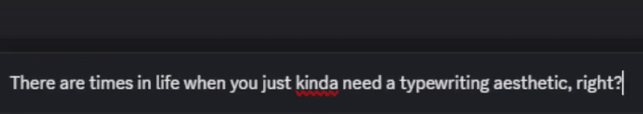

# Typewriter Animated Messages

### Adds a typewriter effect to messages.
|               |
|----------------------------------------------------------------------------------------------|
| How the typewriter effect looks. |

### Settings:

- **Speed**: The speed of the typewriter effect/ delay between each letter in milliseconds.

- **ShowCursor**: Select whether the cursor at the end of the message should appear as it's typing.
 
 
- **Channels**: Channel IDs where the typing effect is enabled (comma-separated).

- **channelTypeToAffect**: What type of channel to enable the animation (All, DMs, GroupDMs, etc.).

### WIP:
- Add a glow to the cursor and animated text to give it a more realistic effect with a setting to toggle.
